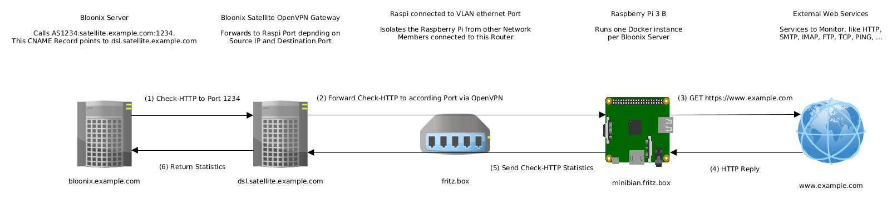
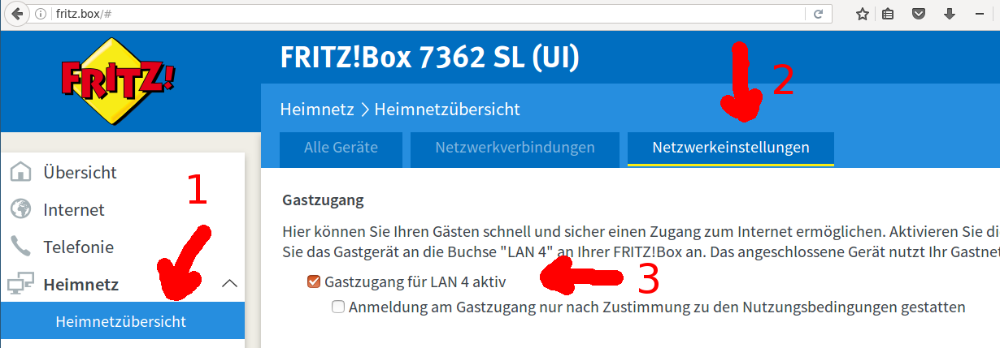

## Bloonix Satellite Installation Instructions for Raspberry Pi 3 Model B


This manual explains how to install Bloonix Satellite with Docker on the Raspberry Pi Model B:




### 1) Install minibian to a micro SD Card

**Insert the SD card**  
Insert the Micro SD Card into your Laptop and use the following command to determine the name of the new device:

```
$ dmesg -T
[...]
[timestamp] mmc0: new ultra high speed SDR104 SDHC card at address 0001
[timestamp] mmcblk0: mmc0:0001 00000 29.8 GiB 
[timestamp] mmcblk0: p1 p2

$ sudo fdisk -l /dev/mmcblk0
Disk /dev/mmcblk0: 32.0 GB, 32010928128 bytes
[...]
```

**Flash minibian to the SD card**  
Go to [sourceforge.net/projects/minibian](https://sourceforge.net/projects/minibian/), download the latest minibian image and
unpack the archive.  Write (or "flash") the minibian image to the SD card:
```bash
# Replace with filename of latest image
dd if=2016-03-12-jessie-minibian.img | pv | sudo dd of=/dev/mmcblk0
sudo sync
sudo partprobe
```

**Resize the / partition to max space**  
These commands will resize the root partition on the SD card to the maximum available space. Copy paste them to the terminal on your Laptop - make sure to set the first variable according to your SD Cards device file name!
```bash
# Set this to your SD card device!
SD_CARD_DEVICE_FILE='/dev/mmcblk0'
start_sector=$(sudo fdisk -l ${SD_CARD_DEVICE_FILE} | grep ${SD_CARD_DEVICE_FILE}p2 | awk '{ print $2 }')
echo -e "d\n2\nn\np\n2\n${start_sector}\n\nw" | sudo fdisk ${SD_CARD_DEVICE_FILE}
sudo sync
sudo e2fsck -f ${SD_CARD_DEVICE_FILE}p2
sudo resize2fs ${SD_CARD_DEVICE_FILE}p2
sudo sync; sudo partprobe
```

**Expected resize output:**  
```
$ SD_CARD_DEVICE_FILE='/dev/mmcblk0'
$ start_sector=$(sudo fdisk -l ${SD_CARD_DEVICE_FILE} | grep ${SD_CARD_DEVICE_FILE}p2 | awk '{ print $2 }')
$ echo -e "d\n2\nn\np\n2\n${start_sector}\n\nw" | sudo fdisk ${SD_CARD_DEVICE_FILE}
Command (m for help): Partition number (1-4): 
Command (m for help): Partition type:
   p   primary (1 primary, 0 extended, 3 free)
   e   extended
Select (default p): Partition number (1-4, default 2): First sector (125056-62521343, default 125056): Last sector, +sectors or +size{K,M,G} (125056-62521343, default 62521343): Using default value 62521343
Command (m for help): The partition table has been altered!
Calling ioctl() to re-read partition table.
Syncing disks.

$ sudo sync
$ sudo e2fsck -f ${SD_CARD_DEVICE_FILE}p2
e2fsck 1.42.9 (4-Feb-2014)
Pass 1: Checking inodes, blocks, and sizes
Pass 2: Checking directory structure
Pass 3: Checking directory connectivity
Pass 4: Checking reference counts
Pass 5: Checking group summary information
/dev/mmcblk0p2: 15631/46944 files (0.2% non-contiguous), 120088/187512 blocks

$ sudo resize2fs ${SD_CARD_DEVICE_FILE}p2
resize2fs 1.42.9 (4-Feb-2014)
Resizing the filesystem on /dev/mmcblk0p2 to 7799536 (4k) blocks.
The filesystem on /dev/mmcblk0p2 is now 7799536 blocks long.
```

**Copy required installer files**
Mount the resized root partition and `git clone` the required installer files to the SD card:
```
sudo mount /dev/mmcblk0p2 /mnt
sudo git clone https://github.com/satellitesharing/bloonix-satellite-raspberrypi.git /mnt/opt/bloonix-satellite-raspberrypi
```

You may want to copy OpenVPN Client configuration files as well. To set up your ssh public key so you can directly login as root via `root@minibian` - depending on your routers local DNS setup:
```
sudo mkdir /mnt/root/.ssh
sudo cp ~/.ssh/id_rsa.pub /mnt/root/.ssh/authorized_keys
sudo chown -R root:root /mnt/root/.ssh
sudo chmod 700 /mnt/root/.ssh
sudo chmod 600 /mnt/root/.ssh/authorized_keys
```

When you are done copying files unmount the root partition on the SD card:
```
sudo umount /mnt
```

**Done formatting the SD card**  
The installation of minibian on the SD card is now complete. Insert it into the Raspberry Pi, attach it to a cable LAN in your network and to a power outlet to boot it.


### 2) Start the installation script on the Raspberry Pi

**Login to the Raspberry Pi**  
Depending on your routers configuration, you should now be able to reach the Raspberry Pi as `minibian`.
```
ssh root@minibian
```

**Edit the setup script variables**  
Now login to the Raspberry Pi. Some variables have to be set for the `setup.sh` installation script to work properly.
```bash
cp /opt/bloonix-satellite-raspberrypi/config.sh.example /opt/bloonix-satellite-raspberrypi/config.sh
vi /opt/bloonix-satellite-raspberrypi/config.sh
```

**Start the setup**  
When the variables are set, start the installation. This might take around ten minutes, depending on your internet speed and class of SD card.
```bash
/opt/bloonix-satellite-raspberrypi/setup.sh
```

When the script is finished, it will tell so and automatically reboot 60 seconds later and you should be able to login via SSH. The hostname of the Raspberry Pi was changed, but the `setup.sh` script will tell you the currently bound IP before it reboots. After any reboot (and once a week via cron), the Raspberry Pi will check if the docker image has any updates. The check script is located in `/opt/bloonix-satellite-raspberrypi/renew-satellite-docker-container-cronjob.sh`. After the first reboot, this script will take a while to pull the docker image and start the container. To check if the script is still running, execute:
```
root@as1234.dsl.satellite.example.com ~ $ ps aux | grep docker
root       575  0.0  0.2   5004  2772 ?        S    14:59   0:00 /bin/bash /opt/bloonix-satellite-raspberrypi/renew-satellite-docker-container-cronjob.sh
root       630 29.0  3.1 878820 31636 ?        Ssl  14:59   0:26 /usr/bin/docker daemon -H fd://
root       668  0.1  0.7 841596  7876 ?        Ssl  14:59   0:00 docker-containerd -l /var/run/docker/libcontainerd/docker-containerd.sock --runtime docker-runc
root       792  1.0  1.7 838932 17580 ?        Sl   15:00   0:00 docker pull satellitesharing/bloonix-satellite:arm
```

To show the logfiles of current Bloonix Satellite container:
```bash
docker logs BloonixSatellite
```

### 3) Configure your router for the Raspberry Pi

While this is not required for operation, it is highly recommended for your own home networks security. The Raspberry Pi should be attached to a local private network where it can not reach any other members of your local network - it should have a subnet to itself. Shorewall rules setup during the installation routine further prevent this.

**Common routers like AVM Fritz Box:**  
Most common routers, like RVM Fritz Box'es, provide the option to assign one lan network port to a "guest network", which cant reach the other networks. Thats what you want to set up, however make sure that nobody else (no house guests) use that network. Also check if the guest wlan provided by your Fritz Box or router allows interactions to and from the guest LAN network.

This following screenshot shows you the correct settings for a FritzBox 7362 SL. I sadly did not find a way to switch the language to english. Go to Homenetwork -> Homenetwork overview -> Network settings -> set a checkbox at "Guest access active on LAN port 4".



**Routers with VLAN capability:**  
If you can setup a proper VLAN, thats even better.

**Note:**  
The setup script disables wlan and bluetooth and the Raspberry Pi by unloading and blacklisting the drivers.
You are hence only access the device via SSH if you are in the same LAN network.

**Test your setup!**  
After setting this up, make sure to test your setup! Connect your laptop to the particular LAN port - if everything works correctly, you should be assigned a different gateway IP than your regular homenetwork. Also you should not be able to access http://fritz.box or similar web interface. You should also be unable to Ping or connect to any machines in connected to your home network via LAN or WLAN.

**Done**  
After the Raspberry Pi is attached to a secure LAN port the installation is finished.
