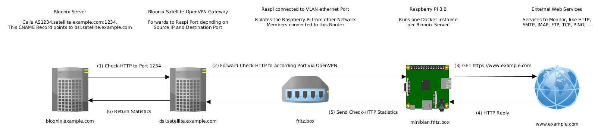

## Bloonix Satellite Installation Instructions for Raspberry Pi 3 Model B


This manual explains how to install Bloonix Satellite with Docker on the Raspberry Pi Model B:




### 1) Install minibian to a micro SD Card

Insert the Micro SD Card into your Laptop and use the following command to determine the name of the new device:

```
$ dmesg -T
[...]
[timestamp] mmc0: new ultra high speed SDR104 SDHC card at address 0001
[timestamp] mmcblk0: mmc0:0001 00000 29.8 GiB 
[timestamp] mmcblk0: p1 p2

$ sudo fdisk -l /dev/mmcblk0
Disk /dev/mmcblk0: 32.0 GB, 32010928128 bytes
[...]
```

Go to [sourceforge.net/projects/minibian](https://sourceforge.net/projects/minibian/), download the latest minibian image and
unpack the archive.  Write the minibian image to the SD card:
```bash
# Replace with filename of latest image
sudo dd if=2016-03-12-jessie-minibian.img | pv | dd of=/dev/mmcblk0
sudo sync
sudo partprobe
```

These commands will resize the root partition on the SD card to the maximum available space. Copy paste them to the terminal on your Laptop - make sure to set the first variable according to your SD Cards device file name!
```bash
# Set this to your SD card device!
SD_CARD_DEVICE_FILE='/dev/mmcblk0'
start_sector=$(sudo fdisk -l ${SD_CARD_DEVICE_FILE} | grep ${SD_CARD_DEVICE_FILE}p2 |  awk '{ print $2 }')
echo -e "d\n2\nn\np\n2\n${start_sector}\n\nw" | sudo fdisk ${SD_CARD_DEVICE_FILE}
sudo sync
sudo e2fsck -f ${SD_CARD_DEVICE_FILE}p2
sudo resize2fs ${SD_CARD_DEVICE_FILE}p2
sudo sync; sudo partprobe
```

Expected output:
```
$ SD_CARD_DEVICE_FILE='/dev/mmcblk0'
$ start_sector=$(sudo fdisk -l ${SD_CARD_DEVICE_FILE} | grep ${SD_CARD_DEVICE_FILE}p2 |  awk '{ print $2 }')
$ echo -e "d\n2\nn\np\n2\n${start_sector}\n\nw" | sudo fdisk ${SD_CARD_DEVICE_FILE}
Command (m for help): Partition number (1-4): 
Command (m for help): Partition type:
   p   primary (1 primary, 0 extended, 3 free)
   e   extended
Select (default p): Partition number (1-4, default 2): First sector (125056-62521343, default 125056): Last sector, +sectors or +size{K,M,G} (125056-62521343, default 62521343): Using default value 62521343
Command (m for help): The partition table has been altered!
Calling ioctl() to re-read partition table.
Syncing disks.

$ sudo sync
$ sudo e2fsck -f ${SD_CARD_DEVICE_FILE}p2
e2fsck 1.42.9 (4-Feb-2014)
Pass 1: Checking inodes, blocks, and sizes
Pass 2: Checking directory structure
Pass 3: Checking directory connectivity
Pass 4: Checking reference counts
Pass 5: Checking group summary information
/dev/mmcblk0p2: 15631/46944 files (0.2% non-contiguous), 120088/187512 blocks

$ sudo resize2fs ${SD_CARD_DEVICE_FILE}p2
resize2fs 1.42.9 (4-Feb-2014)
Resizing the filesystem on /dev/mmcblk0p2 to 7799536 (4k) blocks.
The filesystem on /dev/mmcblk0p2 is now 7799536 blocks long.
```

The installation of minibian on the SD card is now complete. Insert it into the Raspberry Pi, attach it to a cable LAN in your network and to a power outlet to boot it.


### 2) Setup SSH to the Raspberry Pi

Copy your SSH public key to the Raspberry Pi - the password is "raspberry" by default
```bash
ssh-copy-id root@minibian
```

Copy over all required files:
```bash
scp setup.sh root@minibian:/root/
```

Copy over any additional files you might need, like a VPN client setup archive:
```bash
scp vpn-archive.tar.gz root@minibian:
```


### 3) Start the installation script on the Raspberry Pi

Now login to the Raspberry Pi. Some variables have to be set in the script for the installation to work properly. You can install the `nano` editor first if you are not familiar with the pre-installed `vi`:
```bash
apt-get update; apt-get -y install nano
nano setup.sh
```

When the variables are set, start the installation. This might take around ten minutes, depending on your internet speed and class of SD card.
```bash
./setup.sh
```

When the script is finished, it will tell so and automatically reboot 60 seconds later.  

When the Raspberry Pi has booted again, log back in via SSH and execute the following script to create the first Bloonix Satellite Docker container:

```bash
/usr/local/sbin/renew-satellite-docker-container.sh
systemctl restart docker-bloonix-satellite.service
```

To check the status of the systemd service governing the docker container during reboots run:
```bash
systemctl status docker-bloonix-satellite.service
```

To show the logfiles of current production container: 
```bash
docker logs BloonixSatellite
```

### 4) Configure your router for the Raspberry Pi

While this is not required for operation, it is highly recommended for your own home networks security. The Raspberry Pi should be attached to a local private network where it can not reach any other members of your local network - it should have a subnet to itself. Shorewall rules setup during the installation routine further prevent this.

Common routers like AVM Fritz Box:  
Most common routers, like RVM Fritz Box'es, provide the option to assign one lan network port to a "guest network", which cant reach the other networks. Thats what you want to set up, however make sure that nobody else (no house guests) use that network. Also check if the guest wlan provided by your Fritz Box or router allows interactions to and from the guest LAN network.

More expensive routers:  
If you can setup a prover VLAN, thats even better. 


Note:  
The setup script disables wlan and bluetooth and the Raspberry Pi by unloading and blacklisting the drivers.
You are hence only access the device via SSH if you are in the same LAN network.


After the Raspberry Pi is attached to a secure LAN port the installation is finished.
